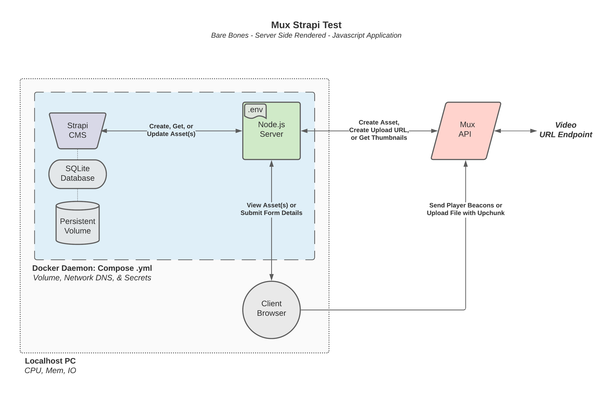

# __Mux Strapi Test__
_Bare Bones - Server Side Rendered - Javascript Application_

----

This first attempt at working with Javascript focused on implementing features from the Mux Video & Mux Data API's along with the Strapi CMS.

Docker is also being used to facilitate volume, network, & secret sharing among containers.

----

## Getting Started
To run this app, you can either focus on using Docker Compose or using Node.js directly (this applies to both the web server & Strapi if needed). 

The main implementation uses Docker Compose to run both a Node container & a Strapi container within their own `Services`.
* Docker Compose
    * Make sure a Docker daemon with DockerHub access is running on your machine (this was built on the MacOS Docker Desktop app). `docker-compose` should be included as a CLI command.
    * Save the `docker-compose.yml` locally in your working directory.
* .Env File (Mux)
    * Create a Mux account and download the access token `.env` file for your environement (an example file is at `.env-example`).
    * Save the `.env` file locally within the same working directory as the `docker-compose.yml` file.

At this point, a `docker-compose up` command should pull in the two images, create the volumes, network DNS, map the secret `.env` file, & create the containers. 

The Node app will run on port `8080` within `localhost` and Strapi will be on port `1337`.

* Configure Strapi
    * The first time starting Strapi with a new persistent volume will require a few configuration steps, but upon reload, it should hold onto the settings as long as the Docker volume still exists.
    * This uses `SQLite` as the Strapi database which is the basic default option to choose, labeled `Quickstart (recommended)` in the menu. If another database needs to be used, the `Service` needs to be updated in the `.yml` file.
    * When the CMS is up, an admin user needs to be created.
    * Next, the `assets` collection type that the app uses needs to be defined with the following 5 text fields (example `assets.settings.json` file included):
        * `title`
        * `description`
        * `asset_id`
        * `playback_id`
        * `upload_id`
    * Finally, the new collection type has to be made `Public` for reading & writing so that the Node app can access the API.

__With this, the whole app should be up and running within Docker.__ 

_Keep in mind, the Node app can be built locally with the Dockerfile and Javascript from Github, or without Docker just as an Express app. The same is true with Strapi, which can be brought it via npm/yarn instead of Docker._

____

# Features

This app lets you view video assets saved within Mux & Strapi, as well as create them.

The main page displays all the assets that get returned from the services, and clicking into one will let you watch the asset. The Mux SDK integrated with the `HLS.js` player will send session data to Mux for viewing within the dashboard. Also, the images on the main page come from the Mux Image API which is generating thumbnails for the video assets.

Creating an asset can be done remotely via a url to the video file or locally via an actual file that gets uploaded to Mux. This app supports both and will update Strapi to include any metadata associated with the new asset.

* Next steps:
    * There are many more features that can be added to help sync the services, or make it easier to delete assets, or view them as a playlist, but that could be implemented in a version 2 of this app that uses a frontend framework. 
    * Since it's my first time working with Node, this version is bare bones and is purely vanilla Javascipt populating pages with dynamic HTML (which doesn't scale easily). Something like Next.js (built on React) or SvelteKit would be used for a v2 of this.

